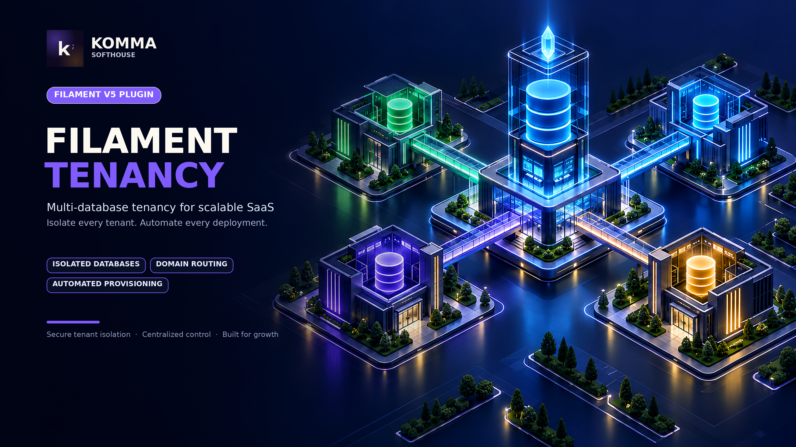
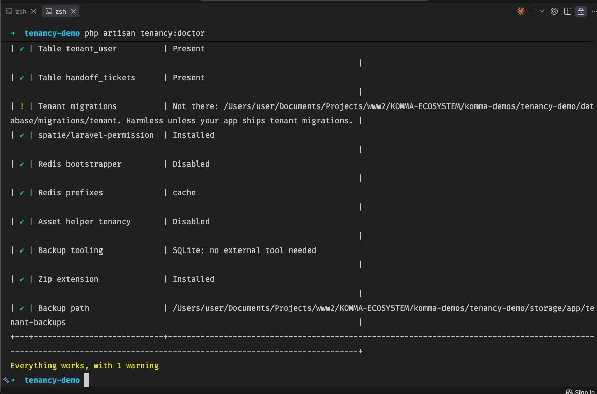
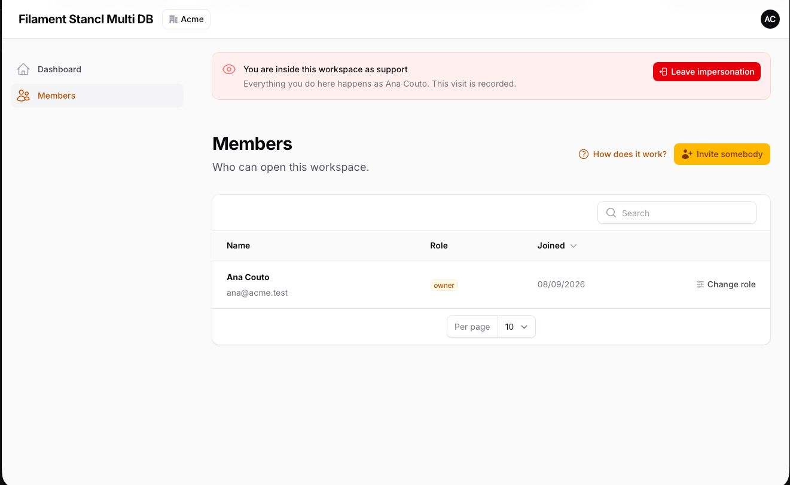
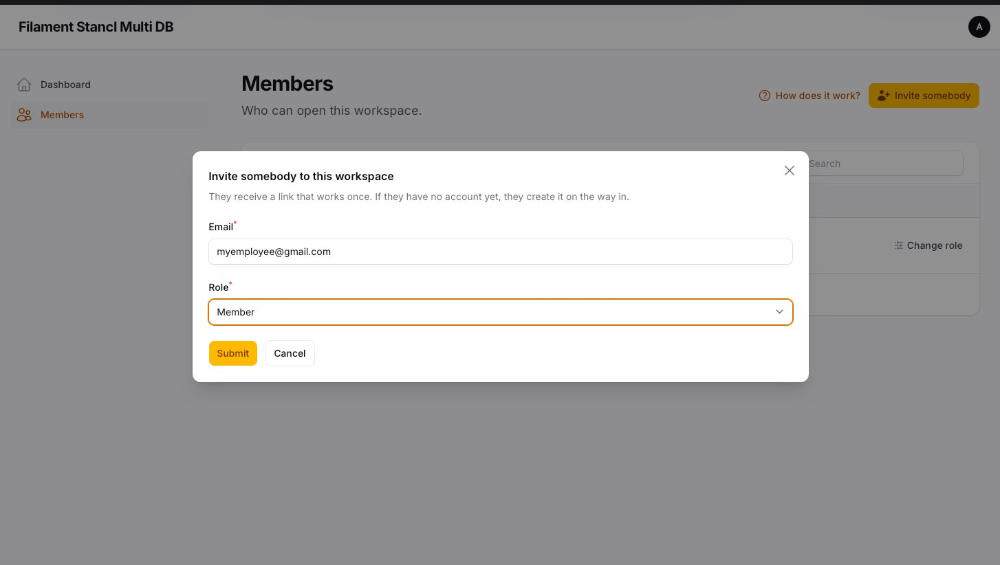
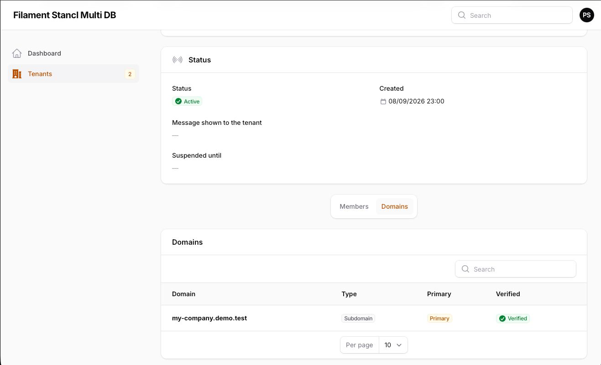
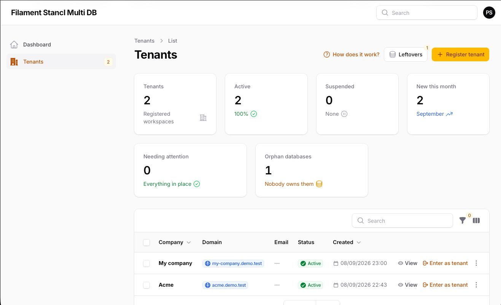
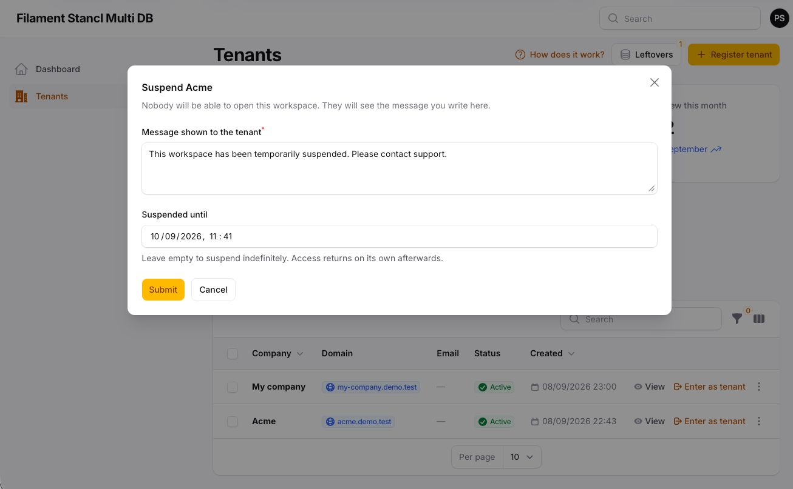
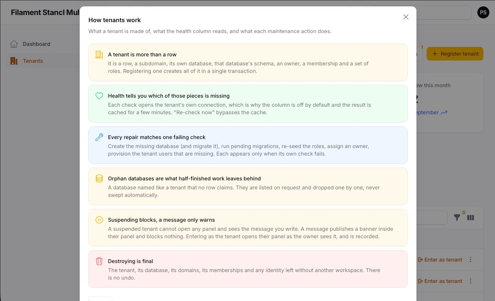
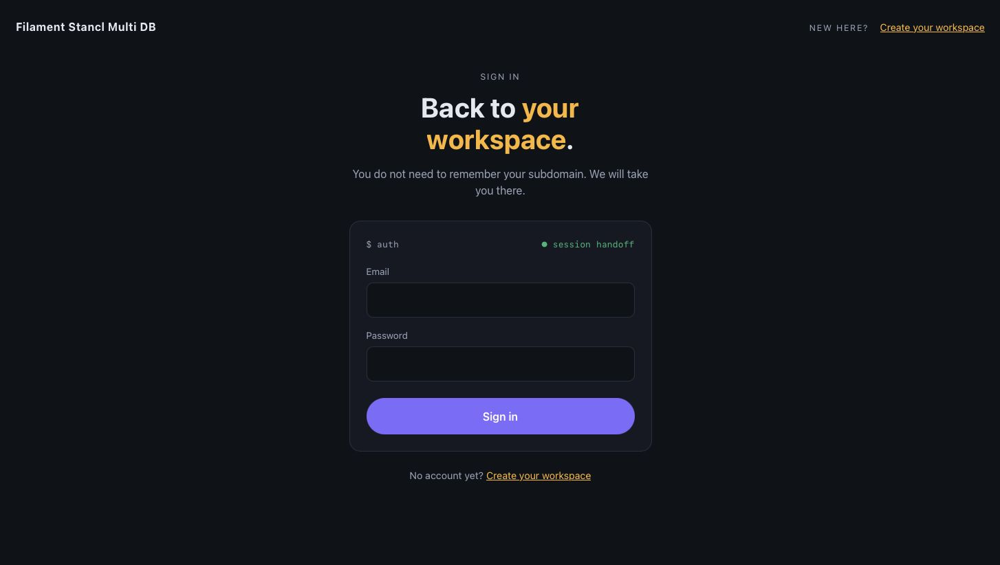

# Filament Tenancy Multi Database

<div class="filament-hidden">



</div>

Database-per-tenant multi-tenancy for **Filament v5**, built on [stancl/tenancy](https://tenancyforlaravel.com/docs/v3/introduction/) and validated in production.

One central identity, one database per tenant, one subdomain per tenant. The plugin brings the whole thing: the connections, the auth guard, the stancl configuration, a login that validates against the central identity, public self-registration, a central "front door" that finds your workspace for you, a signed single-use handoff into the tenant panel, staff impersonation with an audit trail, and the middleware stack that keeps the session on the subdomain.

You register two plugins and keep credentials in `.env`. Nothing else in the host is edited.

## Requirements

- PHP 8.4+
- Laravel 13+
- Filament 5.x, Livewire 4.x
- stancl/tenancy 3.8+
- PostgreSQL, MySQL/MariaDB or SQLite for the central and tenant databases
- spatie/laravel-permission (optional, recommended): per-tenant roles and staff-role access to the Tenants resource

## Installation

```bash
composer require komma-softhouse/filament-tenancy
php artisan filament-tenancy:install
```

The installer publishes the config file and the migrations and offers to run them.

### 1. Credentials

```dotenv
APP_URL=https://demo.test
APP_DOMAIN=demo.test

DB_CENTRAL_DRIVER=pgsql
DB_CENTRAL_HOST=127.0.0.1
DB_CENTRAL_PORT=5432
DB_CENTRAL_DATABASE=central
DB_CENTRAL_USERNAME=postgres
DB_CENTRAL_PASSWORD=secret
```

The plugin registers the `central` and `tenant_template` connections from these values at boot and makes `central` the default connection. `DB_CENTRAL_*` fall back to `DB_*`, so a single-database `.env` also works. On PostgreSQL the central user needs `CREATEDB`; on MySQL, `CREATE` on `*.*`.

### 2. Your central User model

Every tenant member also owns a row on the host's `users` table (the global identity). Add the trait:

```php
use Komma\Tenancy\Concerns\IsCentralIdentity;
use Spatie\Permission\Traits\HasRoles;

class User extends Authenticatable
{
    use HasRoles;
    use IsCentralIdentity;
}
```

It adds `tenants()` and `canAccessPanel()`: only identities holding a staff role may enter the central panel.

### 3. The central panel

```php
use Komma\Tenancy\TenancyPlugin;

$panel
    ->id('admin')
    ->plugin(TenancyPlugin::make());
```

This adds the **Tenants** resource (create, edit, view, delete, *Enter as tenant*) and carries the whole fluent configuration.

### 4. Each tenant panel

```php
use Komma\Tenancy\TenantPanelPlugin;

$panel
    ->id('app')
    ->path('app')
    ->plugin(TenantPanelPlugin::make());
```

Declare **no middleware** on a tenant panel: the plugin applies the complete stack in the order that works. Do not call `->authGuard()` or `->login()` either — both are set by the plugin.

### 5. DNS and web server

`*.demo.test` must reach the application. Locally, dnsmasq with `address=/demo.test/127.0.0.1`; in production a wildcard A record and a wildcard certificate (or a router rule such as Traefik's `HostRegexp`). The plugin does not route traffic; it identifies the tenant from the host it receives.

### 6. Migrate and create the first tenant

```bash
php artisan migrate
php artisan tenancy:create acme --name="Acme SL" --owner-name="María Couto" --owner-email=maria@acme.es --owner-password=secret
```

`https://acme.demo.test/app` now serves the tenant panel; `https://demo.test/login` finds it for you; `https://demo.test/register` creates new ones.

## How it works

- **Central identity.** Credentials live once, in the host's `users` table on the central connection. Each tenant database has its own `users` table with a local row per member (`global_user_id`), which is what Filament authenticates and what roles and tenant data relate to. The local row is provisioned just-in-time on first login.
- **Tenant login.** `Komma\Tenancy\Filament\Pages\Auth\Login` validates email and password against the central identity, checks membership in the current tenant on the central `tenant_user` pivot, provisions the local user if needed and logs it into the tenant guard.
- **Central door.** `/login` on the central domain checks the credentials against central and hands the session to the tenant panel with a signed, single-use ticket. One workspace: straight in. Several: a picker.
- **Handoff.** A `handoff_tickets` row (central) plus a temporary signed URL. Both checks must pass on arrival: the signature proves the URL was issued, the ticket proves it has not been spent. Tickets live 60 seconds and are pruned daily.
- **Impersonation.** Staff open a tenant panel as its owner through the same handoff. The visit is recorded in `impersonations`; a banner marks the session; *Leave* ends it.
- **Session on the subdomain.** On tenant hosts the session cookie is renamed and its domain widened to the base domain, so the login POST and the following GET share one session; the central panel keeps the application cookie.
- **Livewire.** Form submits go to `/livewire/update`, outside the panel middleware. The plugin registers that route with the `universal` group so tenancy initializes on tenant hosts and central keeps working.

## Diagnosing a setup

```bash
php artisan tenancy:doctor
```

Tenancy fails in ways that look like something else: a login that loops because the session cookie is scoped wrong, assets that 404 because they are served from a tenant, a panel that 500s because a config published months ago still names a class that has since changed. None of those errors say "tenancy".



`tenancy:doctor` asks all of it out loud — both connections and whether the central user can actually create databases, `APP_URL` against the base domain, whether `*.base` resolves, the route and config caches, the `universal` group and the Livewire update route, every panel and its guard (including the provider-order trap), the central tables and columns, spatie, the Redis client, the queue prefix, `asset_helper_tenancy`, and the backup tooling. `--tenants` adds a health check per tenant. It exits non-zero when something fails, so it can gate a deploy.

## Testing a host

```php
use Komma\Tenancy\Testing\InteractsWithTenancy;

class TestCase extends BaseTestCase
{
    use InteractsWithTenancy;
}
```

```php
$tenant = $this->createTenant('acme');                  // database, domain, founder, membership, roles
$this->actingAsTenantUser($tenant)->get($this->tenantUrl($tenant, '/app'));
$this->runInTenant($tenant, fn () => Order::factory()->count(3)->create());
$this->endTenancy();
```

Point the central connection at an in-memory SQLite database and let tenant databases be files; the plugin's own suite does exactly that and is worth reading as a working example.

## Members and invitations

A workspace is born with its founder. Everybody else arrives through an invitation.



The tenant panel gets a **Members** page: who is in, with the coarse membership role, and the invitations still pending. Owners and admins (configurable) invite by email, change roles, remove people, resend and revoke. The central panel gets the same as a relation manager on the Tenants resource, so support can fix a workspace without asking its owner to log in.

An invitation is a row in central and a link that works once. Only the hash is stored: the clear token lives in the link and nowhere else. Acceptance happens on the central domain, because the person may have no session and no account yet:



- **No account** — they choose a name and password, the identity is created, the membership and the tenant-local user with it, and they land inside the panel through a signed handoff.
- **Account already** — they confirm with their existing password, and the same thing happens minus the identity.

Nobody gets a session out of a URL: the link identifies the invitation, never the person. Links expire (7 days by default), can be revoked, and are pruned on a schedule.

Removing somebody deletes their membership and their tenant-local user. Their central identity is left alone — that only goes when its last workspace dies. The last owner can be neither removed nor demoted.

## Custom domains

Every tenant is born at `{slug}.base`, and that subdomain is never taken away: it is the service door when anything else breaks. On top of it, a tenant can be reached at a domain of its own.

A custom domain is a **claim until DNS proves it**. Anybody can type a hostname into a form, so an unverified domain serves nothing: `EnsureDomainIsVerified` turns those requests away with the record that is still missing. Two ways to prove it, chosen per domain:

- **TXT** — `_tenancy-verify.example.com` must answer `tenancy-verify={token}`. Proves ownership without touching where the domain points, so it can be created before the cutover.
- **CNAME** — the hostname must point here. Proves ownership and routing at once, but cannot be used on a zone apex like `example.com`.



Manage them from the **Domains** relation manager on the Tenants resource: add, see the pending record, *Verify now*, make one the primary (every URL the platform builds then uses it), remove. `tenancy:domains:verify` re-checks the pending ones and is scheduled hourly, because DNS spreads on its own schedule.

What the plugin does **not** do: route the traffic or issue the certificate. The wildcard that covers `*.base` does not cover `example.com`. Pointing the domain at this server and getting it a certificate belongs to the infrastructure — Traefik or Caddy with on-demand certificates, or one the customer brings. The plugin identifies the tenant from the host it receives, and refuses to serve one whose owner never asked for it.

## Operations

The Tenants resource is where a workspace is run, not just listed.



- **Health.** Six checks per tenant — database, schema (pending migrations), domain, owner, tenant users, roles — behind a short cache. A `Health` column, an infolist section listing exactly what is missing, a widget counting the tenants that need attention, and a filter to see only those.
- **Repairs.** Each failing check gets its own action under *Maintenance*: create the missing database (and migrate it), run pending migrations, re-seed the roles, assign an owner, provision the tenant users that are missing. Never one button that silently does six things.
- **Leftovers.** Databases *and* storage directories with the tenant naming pattern that no tenant row claims — what a half-finished creation or a hand-deleted row leaves behind. Listed on demand from the server itself, dropped one by one and only when you ask.
- **Storage.** stancl gives each tenant a directory of its own and never removes it; the plugin deletes it along with the tenant, reports its size in the list and the infolist, and lists the orphans.


- **Suspension.** Block a tenant with the reason you write and, optionally, a date it comes back on its own. `EnsureTenantIsActive` turns every request away with that message; support keeps access while impersonating.
- **Notices.** Publish a banner into a tenant's panel (info, warning or urgent, with an optional expiry), and optionally email the same text to its members.
- **Backups.** A tenant in a box: the database dump, the files and a `manifest.json` with the tenant row, its domains and its members. `tenancy:backup` for one tenant or all of them, a *Back up now* action in the panel, and a *back it up first* toggle on the destroy action — if that backup fails, nothing is deleted. The dump is delegated to `pg_dump` / `mysqldump` (a straight file copy on SQLite); when the tool is not on the server, the plugin says so up front instead of writing half a backup.
- **Restore.** `tenancy:restore backup.zip [--id=]` rebuilds the tenant from the manifest, loads the dump and copies the files back. It refuses to write over a live tenant — restoring on top of one is a merge nobody asked for. Identities are referenced by email and never recreated: members whose account no longer exists are reported so you can invite them again.
- **Destruction.** Type the subdomain to confirm, then the tenant, its database, its files, its domains, its memberships and any identity left without another workspace are gone.

Every page the plugin adds to a panel carries a **How does it work?** modal in its header, and every visual element is a Filament component, so the plugin inherits the panel's theme instead of bringing its own.




Read [docs/ARCHITECTURE.md](docs/ARCHITECTURE.md) for the full picture.

## Configuration

Every option lives in `config/filament-tenancy.php` and every one of them has a fluent counterpart. Fluent calls win over the file. Closures (redirects, hooks) exist only fluently.

### `TenancyPlugin` (central panel)

| Method | Config key | Default | What it does |
|---|---|---|---|
| `baseDomain(string)` | `domain.base` | `APP_DOMAIN`, else the host of `APP_URL` | Root under which tenants live as `{slug}.base` |
| `centralDomains(array)` | `domain.central_domains` | `127.0.0.1`, `localhost`, the base domain, `TENANCY_CENTRAL_DOMAINS` (comma list) | Hosts served without tenancy |
| `centralConnection(string, bool $register = true)` | `database.central_connection`, `database.register_connections` | `central`, `true` | Name of the central connection; `false` to reuse one the host defines |
| `tenantConnectionTemplate(string)` | `database.template_connection` | `tenant_template` | Connection stancl copies for each tenant database |
| `databaseDriver(string)` | `database.driver` | `DB_CENTRAL_DRIVER`, else `DB_CONNECTION`, else `pgsql` | `pgsql`, `mysql`, `mariadb`, `sqlite` |
| `setDefaultConnection(bool)` | `database.set_default_connection` | `true` | Switch `database.default` to the central connection |
| `databaseNaming(string $prefix, string $suffix)` | `database.prefix`, `database.suffix` | `tenant`, `''` | Tenant database name = prefix + id + suffix |
| `databaseManagers(array)` | `database.managers` | stancl's sqlite/mysql/mariadb/pgsql managers | driver ⇒ `TenantDatabaseManager` |
| `tenantModel(string)` | `models.tenant` | `Komma\Tenancy\Models\Tenant` | Extend it in the host |
| `domainModel(string)` | `models.domain` | `Komma\Tenancy\Models\Domain` | Extend it in the host; the plugin's own carries the verification and primary columns |
| `centralUserModel(string)` | `models.central_user` | `App\Models\User` | The host's identity model (uses `IsCentralIdentity`) |
| `tenantUserModel(string)` | `models.tenant_user` | `Komma\Tenancy\Models\TenantUser` | The user model inside tenant databases |
| `tenantColumns(array)` | `models.tenant_columns` | `[]` | Extra real columns on `tenants` |
| `centralGuard(string)` | `auth.central_guard` | `web` | |
| `tenantGuard(string, string $provider, bool $register)` | `auth.tenant_guard`, `auth.tenant_provider`, `auth.register_guard` | `tenant`, `tenant_users`, `true` | Guard and provider registered for tenant users |
| — | `auth.pin_central_password_broker`, `auth.central_password_broker` | `true`, `users` | Pin the central password broker to the central connection |
| `centralPanel(string)` | `panels.central` | `admin` (set automatically from the panel this plugin is registered on) | |
| `tenantPanels(array $map, ?string $defaultKind)` | `panels.tenant`, `panels.default_kind` | `['business' => 'app']`, `business` | Tenant kind ⇒ panel id (panels with `TenantPanelPlugin` add themselves) |
| `staffRoles(array)` | `roles.staff` | `super-admin, support, finance, staff` | Central roles allowed into the central panel and the Tenants resource |
| `manageRoles(array)` | `roles.manage` | `super-admin` | Roles that may create, edit, delete tenants |
| `tenantRoles(array, ?string $owner)` | `roles.tenant`, `roles.owner` | `owner, admin, member`, `owner` | Seeded in every new tenant database; the founder gets `$owner` |
| `seedTenantRoles(bool)` | `roles.seed_tenant_roles` | `true` | |
| `spatiePermissionScoping(bool)` | `roles.scope_permission_cache` | `true` | Per-tenant spatie permission cache key |
| `session(string $tenantCookie, bool $wildcardDomain)` | `session.tenant_cookie`, `session.wildcard_domain` | `tenant_session`, `true` | Session cookie on tenant hosts |
| `centralLogin(bool, ?string $path, ?string $name, ?string $throttle)` | `central_login.*` | `true`, `login`, `login` / `login.store`, `10,1` | The central door |
| `registration(bool, ?string $path, ?string $name, ?string $component)` | `registration.*` | `true`, `register`, `register`, `RegisterTenant::class` | Public self-registration |
| `centralLoginView(string)` | `central_login.view` | `filament-tenancy::auth.login` | The Blade view rendered on GET `/login` |
| `centralLoginController(string)` | `central_login.controller` | `Komma\Tenancy\Http\Controllers\EntryController` | The controller behind both verbs of `/login` |
| `authLayout(string)` | `views.auth_layout` | `filament-tenancy::components.layouts.auth` | Layout of the central login, the registration page and the suspension page |
| `registrationKinds(array)` | `registration.kinds` | `['business']` | Kinds accepted through `?kind=` |
| `captcha(?string $rule, ?string $view)` | `registration.captcha_rule`, `registration.captcha_view` | `null`, `null` | A validation rule class for the token and the Blade view of the widget (bound to `wire:model="captchaResponse"`) |
| `honeypot(bool)` | `registration.honeypot` | `true` | |
| `registrationRateLimit(int $attempts, int $decay)` | `registration.rate_limit` | `3`, `60` | Per IP |
| `passwordMinLength(int)` | `registration.password_min` | `8` | |
| — | `registration.email_rule` | `email:rfc,dns` | |
| `reservedSubdomains(array, bool $merge = true)` | `reserved_subdomains` | `www, admin, api, app, mail, …` (see the file) | Never registrable |
| `registrationRedirect(Closure)` | — | the tenant panel URL | `fn (Tenant $tenant): string` |
| `onTenantRegistered(Closure)` | — | — | `fn (Tenant $tenant, Model $owner): void`, inside the birth transaction |
| `afterLoginRedirect(Closure)` | — | the panel home | `fn (Tenant $tenant, Model $globalUser, ?string $intent): ?string`, after a handoff is claimed |
| `handoff(int $ttl, int $pruneAfterDays, bool $schedulePrune)` | `handoff.*` | `60`, `7`, `true` | |
| `impersonation(bool, ?array $roles, ?array $protectedRoles)` | `impersonation.*` | `true`, `super-admin, support`, `super-admin` | Who may impersonate; identities that never can be |
| — | `impersonation.leave_path`, `impersonation.leave_name`, `impersonation.banner` | `impersonation/leave`, `impersonation.leave`, `true` | |
| `invitations(bool, ?int $ttlDays, ?array $roles, ?bool $email)` | `invitations.enabled`, `invitations.ttl_days`, `invitations.roles`, `invitations.email` | `true`, `7`, `owner, admin`, `true` | How somebody who is not the founder joins a workspace |
| `invitationRole(string)` | `invitations.default_role` | `member` | Role an invitation carries by default |
| `invitationPage(?string $view, ?string $controller, ?string $path)` | `invitations.view`, `invitations.controller`, `invitations.path` | the plugin's own, `invitations/{token}` | The acceptance page |
| `customDomains(bool, ?string $verification, ?string $cnameTarget, ?bool $scheduleVerify)` | `domains.custom`, `domains.default_verification`, `domains.cname_target`, `domains.schedule_verify` | `true`, `txt`, `null` (the base domain), `true` | Domains of a tenant's own, and how they are proved |
| `domainVerificationRecord(string $name, ?string $prefix)` | `domains.txt_record`, `domains.txt_prefix` | `_tenancy-verify`, `tenancy-verify=` | The TXT record a domain must answer |
| `storage(bool $deleteOnDestroy, ?bool $orphans, ?string $root)` | `storage.delete_on_destroy`, `storage.orphans`, `storage.root` | `true`, `true`, `null` | The per-tenant storage directory |
| `backups(bool, ?string $path, ?bool $withStorage, ?bool $beforeDestroy, ?bool $zip)` | `backups.*` | `true`, `storage/app/tenant-backups`, `true`, `true`, `true` | Database dump, files and manifest |
| `backupBinaries(array)` | `backups.binaries` | all `null` (found on the PATH) | Absolute paths to `pg_dump`, `psql`, `mysqldump`, `mysql` |
| `healthChecks(bool, ?int $cacheTtl, ?bool $orphanDatabases)` | `health.enabled`, `health.cache_ttl`, `health.orphan_databases` | `true`, `300`, `true` | Completeness checks, the repairs they enable, and the orphan-database list |
| `widgets(bool $stats, ?bool $health)` | `widgets.stats`, `widgets.health` | `true`, `true` | Widgets on the Tenants list page |
| `suspension(bool)` | `suspension.enabled` | `true` | Block a tenant's panels with the operator's message |
| `notices(bool, bool $email)` | `notices.enabled`, `notices.email` | `true`, `false` | Publish a banner into a tenant's panel; optionally email its members |
| `centralRoutes(bool)` | `routes.central` | `true` | `/register`, `/login`, `/impersonation/leave` |
| `tenantRoutes(bool, bool $loadHostFile)` | `routes.tenant`, `routes.host_tenant_routes` | `true`, `true` | `/whoami` on tenant hosts and the host's `routes/tenant.php` |
| `afterTenantCreated(array $jobs, bool $queued)` | `pipeline.after_created`, `pipeline.queued` | `[]`, `false` | Jobs after database, migrations and roles; each receives the tenant |
| `tenantMigrationPaths(array, bool $merge = true)` | `migrations.tenant_paths` | `database/migrations/tenant` (the plugin's own are always included) | |
| `tenantSeeders(string)` | `migrations.tenant_seeder` | `DatabaseSeeder` | Root seeder for `tenants:seed` |
| `bootstrappers(array)` | `bootstrappers` | Database, Cache, Filesystem, Queue, Redis | stancl bootstrappers |
| `cacheTag(string)` | `cache.tag_base` | `tenant` | |
| `filesystemDisks(array, ?array $rootOverride, ?bool $suffixStoragePath)` | `filesystem.*` | `local, public`; storage-path overrides; `true` | |
| `redis(?bool $enabled, ?array $prefixedConnections, ?string $prefixBase)` | `redis.enabled`, `redis.prefixed_connections`, `redis.prefix_base` | `null` (autodetect: on only when phpredis or predis is installed), `['cache']`, `tenant` | The per-tenant Redis bootstrapper |
| `redisPrefixedConnections(array)` | `redis.prefixed_connections` | `['cache']` | Never the queue: a job already carries its tenant |
| — | `id_generator` | `Stancl\Tenancy\UUIDGenerator` | |
| — | `tenant_panel_middleware` | `[]` | Appended to every tenant panel after tenancy is initialized |
| `tenantResource(bool)` | — | `true` | Register the Tenants resource on the central panel |
| `tenantResourceRelationManagers(array)` | — | `[]` | Relation managers shown on the Tenants resource |
| `configure(string $key, mixed $value)` | any | — | Escape hatch for any key |

### `TenantPanelPlugin` (each tenant panel)

| Method | Config key | Default | What it does |
|---|---|---|---|
| `kind(string)` | — | `panels.default_kind` | The tenant kind this panel serves |
| `login(string $page)` | — | `Komma\Tenancy\Filament\Pages\Auth\Login` | Extend to customise |
| `profile(bool, ?string $page)` | `profile.enabled` | `true`, `Komma\Tenancy\Filament\Pages\Auth\EditProfile` | Profile page that writes to the central identity |
| `passwordReset(bool)` | `profile.password_reset` | `true` | |
| `passwordReminder(bool)` | `profile.password_reminder` | `true` | Banner for invited members without a password |
| `impersonationBanner(bool)` | `impersonation.banner` | `true` | |
| `members(bool, ?string $page)` | `invitations.enabled` | `true`, `Komma\Tenancy\Filament\Pages\Members` | The workspace's own people page |
| `suspension(bool)` | `suspension.enabled` | `true` | Apply `EnsureTenantIsActive` on this panel |
| `notices(bool)` | `notices.enabled` | `true` | Show the operator's banner on this panel |
| `middleware(array)` | `tenant_panel_middleware` | `[]` | After tenancy is initialized, before `PreventAccessFromCentralDomains` |
| `afterLoginRedirect(Closure)` | — | — | Same as on `TenancyPlugin` |
| `sessionCookie(string, bool $wildcardDomain)` | `session.*` | `tenant_session`, `true` | Same as `session()` on `TenancyPlugin` |

A tenant panel gets: `authGuard(tenant)`, the plugin's `Login`, `EditProfile`, password reset, the middleware stack (`SetSubdomainUrlDefault`, cookies, session, errors, CSRF, bindings, Filament, `InitializeTenancyByDomain`, your extras, `PreventAccessFromCentralDomains`), `Authenticate` as auth middleware, and the two banners.

### Every option at a glance

Nothing below is required: each line is the default, written out so the whole
surface is visible in one place. Delete what you do not need.

```php
// Central panel
->plugin(
    TenancyPlugin::make()
        // ── Domain ─────────────────────────────────────────────────────
        ->baseDomain(env('APP_DOMAIN', 'demo.test'))
        ->centralDomains(['demo.test', '127.0.0.1', 'localhost'])
        // ── Database ───────────────────────────────────────────────────
        ->centralConnection('central', register: true)
        ->tenantConnectionTemplate('tenant_template')
        ->databaseDriver('pgsql')                       // pgsql | mysql | mariadb | sqlite
        ->setDefaultConnection(true)
        ->databaseNaming(prefix: 'tenant', suffix: '')
        ->databaseManagers([
            'sqlite' => SQLiteDatabaseManager::class,
            'mysql' => MySQLDatabaseManager::class,
            'mariadb' => MySQLDatabaseManager::class,
            'pgsql' => PostgreSQLDatabaseManager::class,
        ])
        // ── Models ─────────────────────────────────────────────────────
        ->tenantModel(Tenant::class)
        ->domainModel(Domain::class)
        ->centralUserModel(User::class)
        ->tenantUserModel(TenantUser::class)
        ->tenantColumns([])                             // additional physical columns in `tenants`
        // ── Auth ───────────────────────────────────────────────────────
        ->centralGuard('web')
        ->tenantGuard('tenant', provider: 'tenant_users', register: true)
        // ── Panels ─────────────────────────────────────────────────────
        ->centralPanel('admin')                         // set automatically when the plugin is registered
        ->tenantPanels(['business' => 'app'], defaultKind: 'business')
        // ── Roles ──────────────────────────────────────────────────────
        ->staffRoles(['super-admin', 'support', 'finance', 'staff'])
        ->manageRoles(['super-admin'])
        ->tenantRoles(['owner', 'admin', 'member'], owner: 'owner')
        ->seedTenantRoles(true)
        ->spatiePermissionScoping(true)
        // ── Session ────────────────────────────────────────────────────
        ->session(tenantCookie: 'tenant_session', wildcardDomain: true)
        // ── Central login gateway /login ───────────────────────────────
        ->centralLogin(true, path: 'login', name: 'login', throttle: '10,1')
        ->centralLoginView('filament-tenancy::auth.login')
        ->centralLoginController(EntryController::class)
        ->authLayout('filament-tenancy::components.layouts.auth')
        // ── Public registration /register ──────────────────────────────
        ->registration(true, path: 'register', name: 'register', component: RegisterTenant::class)
        ->registrationKinds(['business'])
        ->captcha(rule: null, view: null)               // e.g. Turnstile::class, 'components.turnstile'
        ->honeypot(true)
        ->registrationRateLimit(attempts: 3, decaySeconds: 60)
        ->passwordMinLength(8)
        ->reservedSubdomains(['billing', 'support'], merge: true)
        ->registrationRedirect(fn ($tenant) => null)
        ->onTenantRegistered(fn ($tenant, $owner) => null)
        ->afterLoginRedirect(fn ($tenant, $globalUser, ?string $intent) => null)
        // ── Invitations ────────────────────────────────────────────────
        ->invitations(true, ttlDays: 7, roles: ['owner', 'admin'], email: true)
        ->invitationRole('member')
        ->invitationPage(view: null, controller: null, path: 'invitations/{token}')
        // ── Custom domains ─────────────────────────────────────────────
        ->customDomains(true, verification: 'txt', cnameTarget: null, scheduleVerify: true)
        ->domainVerificationRecord('_tenancy-verify', 'tenancy-verify=')
        // ── Handoff and impersonation ──────────────────────────────────
        ->handoff(ttlSeconds: 60, pruneAfterDays: 7, schedulePrune: true)
        ->impersonation(true, roles: ['super-admin', 'support'], protectedRoles: ['super-admin'])
        // ── Operations ─────────────────────────────────────────────────
        ->healthChecks(true, cacheTtl: 300, orphanDatabases: true)
        ->widgets(stats: true, health: true)
        ->suspension(true)
        ->notices(true, email: false)
        // ── Storage and backups ────────────────────────────────────────
        ->storage(deleteOnDestroy: true, orphans: true, root: null)
        ->backups(true, path: null, withStorage: true, beforeDestroy: true, zip: true)
        ->backupBinaries(['pg_dump' => null, 'psql' => null, 'mysqldump' => null, 'mysql' => null])
        // ── Routes ─────────────────────────────────────────────────────
        ->centralRoutes(true)
        ->tenantRoutes(true, loadHostFile: true)
        // ── Pipeline, migrations, seeders ──────────────────────────────
        ->afterTenantCreated([], queued: false)         // jobs that receive the tenant
        ->tenantMigrationPaths([database_path('migrations/tenant')], merge: true)
        ->tenantSeeders('DatabaseSeeder')
        // ── stancl bootstrappers ───────────────────────────────────────
        ->bootstrappers([
            DatabaseTenancyBootstrapper::class,
            CacheTenancyBootstrapper::class,
            FilesystemTenancyBootstrapper::class,
            QueueTenancyBootstrapper::class,
            RedisTenancyBootstrapper::class,
        ])
        ->cacheTag('tenant')
        ->filesystemDisks(['local', 'public'], rootOverride: [
            'local' => '%storage_path%/app/',
            'public' => '%storage_path%/app/public/',
        ], suffixStoragePath: true)
        ->redis(null, prefixedConnections: ['cache'])   // true requires a client · null auto-detects
        // ── Central panel interface ────────────────────────────────────
        ->tenantResource(true)
        ->tenantResourceRelationManagers([])
        // ── Escape hatch ───────────────────────────────────────────────
        ->configure('registration.email_rule', 'email:rfc')
);
```

```php
// Tenant panel
->plugin(
    TenantPanelPlugin::make()
        ->kind('business')
        ->login(Login::class)
        ->profile(true, page: EditProfile::class)
        ->passwordReset(true)
        ->passwordReminder(true)
        ->members(true, page: Members::class)
        ->impersonationBanner(true)
        ->suspension(true)
        ->notices(true)
        ->middleware([])                                // after InitializeTenancyByDomain
        ->afterLoginRedirect(fn ($tenant, $globalUser, ?string $intent) => null)
        ->sessionCookie('tenant_session', wildcardDomain: true)
);
```

### Several tenant panels

```php
// Central
TenancyPlugin::make()->tenantPanels(['business' => 'app', 'developer' => 'dev'])->registrationKinds(['business', 'developer']);

// Panels
TenantPanelPlugin::make()->kind('business');   // on the 'app' panel
TenantPanelPlugin::make()->kind('developer');  // on the 'dev' panel
```

A tenant's `kind` decides the panel it is sent to and the only panel its users may access. `/register?kind=developer` creates developer tenants.

### Order of registration

`TenantPanelPlugin::register()` reads the guard name and the profile switches when the tenant panel registers. If you change them fluently on `TenancyPlugin`, register the central panel provider before the tenant panel providers, or set them in the config file.

## Replacing the pages

Every page the plugin renders can be swapped without publishing a view.

```php
// Central panel
TenancyPlugin::make()
    ->authLayout('layouts.brand')                      // login, register and suspended
    ->centralLoginView('auth.login')                   // just the body of /login
    ->centralLoginController(MyEntryController::class) // or the logic behind it
    ->registration(component: MyRegisterTenant::class);

// Tenant panel
TenantPanelPlugin::make()
    ->login(MyLogin::class)
    ->profile(true, MyEditProfile::class);
```

Extend the plugin's classes rather than starting from scratch: `Login` carries the central-identity check and the handoff claim, `EntryController` the credential check and the signed handoff, `RegisterTenant` the guards and the birth transaction. A layout receives the body as `$slot` and the page title as `$title`. To edit the shipped views instead, publish them with `php artisan vendor:publish --tag=filament-tenancy-views`.

## Commands

| Command | What it does |
|---|---|
| `filament-tenancy:install` | Publish config and migrations, offer to migrate |
| `tenancy:create {subdomain} --name= --owner-name= --owner-email= --owner-password= --kind= --id= --force` | Create a tenant with database, domain, founder, membership and roles |
| `tenancy:destroy {tenant} --force` | Delete a tenant, its database, files, memberships and orphaned identities |
| `tenancy:backup {tenant?} --path= --no-zip --without-storage` | Back up one tenant or every tenant |
| `tenancy:restore {backup} --id= --force` | Rebuild a tenant from a backup |
| `tenancy:domains:verify --tenant=` | Re-check the DNS of every custom domain still pending |
| `tenancy:doctor --tenants` | Diagnose the whole setup: connections, DNS, routes, caches, panels, tooling |
| `tenants:migrate`, `tenants:seed`, `tenants:run` | stancl's own, already configured with the plugin's paths |

## Hooks

- `Komma\Tenancy\Events\TenantRegistered($tenant, $owner)` — fired inside the birth transaction by `TenantRegistrationService`.
- stancl's own events (`TenantCreated`, `TenancyInitialized`, …) keep working; the plugin registers the pipeline and the bootstrap listeners.
- `afterTenantCreated([...])` for jobs that seed a new tenant database.
- `onTenantRegistered()`, `registrationRedirect()`, `afterLoginRedirect()` for the doors.

## Services

| Class | Purpose |
|---|---|
| `Komma\Tenancy\Services\TenantRegistrationService` | The only way a tenant is born |
| `Komma\Tenancy\Services\Membership` | The central `tenant_user` pivot |
| `Komma\Tenancy\Services\Handoff` | Mint a signed single-use URL into a tenant panel |
| `Komma\Tenancy\Services\Impersonate` | Staff entry as the tenant owner, recorded |
| `Komma\Tenancy\Services\Invitations` | Invite, resend, accept, change role, remove |
| `Komma\Tenancy\Services\TenantHealth` | Per-tenant completeness checks, cached |
| `Komma\Tenancy\Services\TenantRepair` | Create the missing database, migrate, seed roles, assign owner, provision users |
| `Komma\Tenancy\Services\Domains` | Add, verify, promote and remove the domains of a tenant |
| `Komma\Tenancy\Services\TenantStorage` | Where a tenant's files are, how big they are, and which directories are orphaned |
| `Komma\Tenancy\Services\TenantBackup` | Create, inspect and restore a backup |
| `Komma\Tenancy\Services\DatabaseInventory` | What is physically on the server, and which of it is orphaned |
| `Komma\Tenancy\Tenancy` | Runtime configuration (`app(Tenancy::class)`) |

`Komma\Tenancy\Filament\RelationManagers\TenantsRelationManager` can be added to the host's User resource to manage memberships.

## Database

Central (host migrations, published): `tenants` (with `status_message`, `status_until` and `notice` for operations), `domains` (with `type`, `is_primary`, `verified_at` and the verification token), `tenant_user`, `tenant_invitations`, `handoff_tickets`, `impersonations`, plus `ulid`, `status` and `password_set_at` on `users`. Tenant (run by `tenants:migrate`, shipped by the plugin): `users`, `sessions`, `password_reset_tokens`, and spatie's permission tables when the package is installed. Sessions on tenant hosts live in the tenant database when `SESSION_DRIVER=database`.

## Translations

English keys, resolved as JSON translations; Spanish, Galician and Portuguese included. They apply when the application locale matches (`APP_LOCALE=es`), with English as the fallback. Publish and edit them with `php artisan vendor:publish --tag=filament-tenancy-translations`, which writes to `lang/vendor/filament-tenancy/`.

## License

Proprietary. See [LICENSE.md](LICENSE.md).